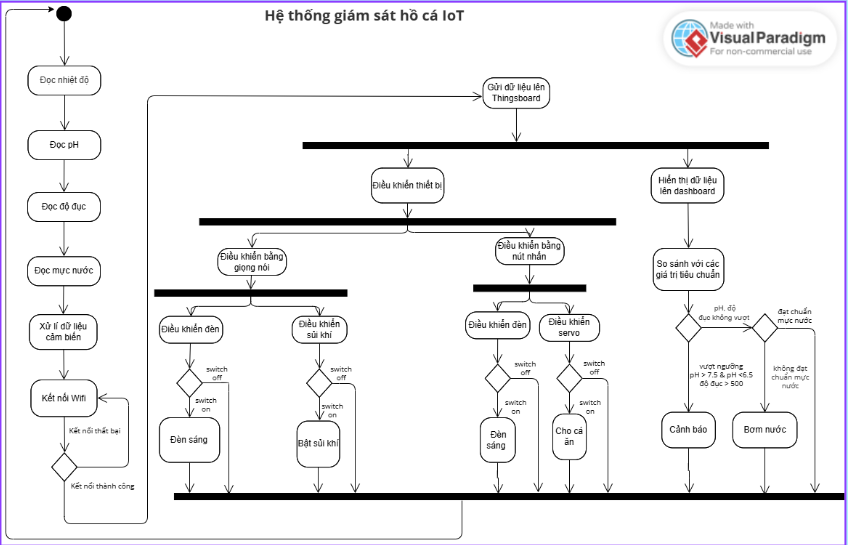

# HỆ THỐNG IOT HỒ CÁ

## 1. Giới thiệu
Trong bối cảnh công nghệ IoT (Internet of Things) ngày càng phát triển, việc ứng dụng IoT vào lĩnh vực nông nghiệp, chăn nuôi và thủy sinh đang được quan tâm mạnh mẽ. Hệ thống giám sát và điều khiển hồ cá thông minh là một giải pháp giúp người nuôi quản lý các thông số môi trường trong hồ cá một cách tự động, tiện lợi và hiệu quả.

Đồ án “Hệ thống IoT hồ cá sử dụng FreeRTOS” được xây dựng nhằm hiện thực hóa ý tưởng này. Hệ thống sử dụng vi điều khiển ESP32 làm trung tâm, kết hợp các cảm biến để đo các thông số quan trọng như:

- Nhiệt độ nước

- Độ pH

- Độ đục (turbidity)

- Mực nước

Ngoài ra, hệ thống còn tích hợp các cơ cấu chấp hành như bơm, quạt, đèn LED… để tự động điều chỉnh môi trường nuôi theo ngưỡng đã định.

FreeRTOS được áp dụng để quản lý đa nhiệm, giúp các tác vụ như đọc cảm biến, điều khiển thiết bị, hiển thị thông số trên OLED, và truyền dữ liệu lên nền tảng IoT được thực hiện song song, ổn định và có độ tin cậy cao.

## 2. Sơ đồ activity

## 3. Nguyên lý hoạt động tổng thể
Hệ thống giám sát hồ cá IoT hoạt động theo các bước chính:

1. Thu thập dữ liệu từ cảm biến

- Các cảm biến gắn trong hồ cá sẽ lần lượt đo các thông số: nhiệt độ nước, độ pH, độ đục và mực nước.

- Dữ liệu thu được được xử lý, lọc và chuẩn hóa để đảm bảo tính chính xác.

2. Kết nối WiFi và gửi dữ liệu lên nền tảng IoT

- ESP32 sẽ kết nối WiFi. Nếu kết nối thất bại, hệ thống báo lỗi; nếu thành công, dữ liệu được gửi lên ThingsBoard (hoặc nền tảng IoT khác).

- Tại đây, người dùng có thể theo dõi thông số qua dashboard.

3. Xử lý và điều khiển thiết bị tại chỗ

- Hệ thống so sánh dữ liệu đo được với ngưỡng tiêu chuẩn:

- Nếu các giá trị (pH, độ đục, mực nước) nằm ngoài chuẩn → hệ thống phát cảnh báo và/hoặc kích hoạt bơm nước để cải thiện môi trường.

- Người dùng cũng có thể điều khiển thiết bị thủ công bằng: Giọng nói( bật/tắt đèn, bật/tắt máy sủi khí), nút nhấn( bật/tắt đèn, điều khiển servo cho cá ăn).

4. Điều khiển các thiết bị chấp hành

- Đèn chiếu sáng: tự động hoặc theo lệnh người dùng.

- Máy sủi khí: cung cấp oxy khi cần.

- Servo cho ăn: tự động thả thức ăn theo lịch hoặc khi người dùng nhấn nút.

- Bơm nước: hoạt động khi mực nước thấp hoặc chất lượng nước không đạt chuẩn.

- Hiển thị và giám sát

5. Các thông số đo được hiển thị trên màn hình OLED và đồng thời cập nhật liên tục lên dashboard ThingsBoard để người dùng theo dõi từ xa qua Internet.